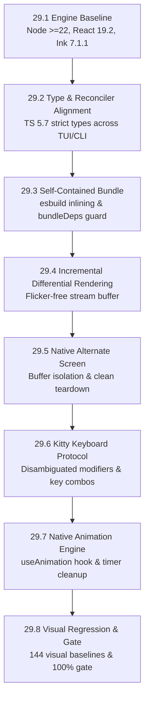

# Phase 29 — Frontier Presentation Engine: Ink 7 & React 19 Architecture Guide

> **Version:** v1.2.0 → v1.3.0 / v2.0.0-alpha  
> **Date:** 2026-09-28  
> **Author:** Chief Engineer  
> **Core Mandate:** *"We are not making some cheap copy here; we are building frontier coding tools."*  
> **Scope:** Complete presentation engine overhaul: upgrading `@anvil/tui` and `@anvil/cli` to Ink 7 (`ink@7.1.1`), React 19 (`react@19.2.0`), Node 22+ (`node: >=22`), activating concurrent rendering, flicker-free incremental differential screen updates, native Kitty keyboard protocol handling, and non-blocking autonomous agent reactivity.

---

## 🏛️ 1. Frontier Vision: The Philosophy Behind Phase 29

Most terminal coding assistants are wrappers around basic standard streams with rudimentary prompt loops. When models stream tokens or execute high-volume multi-file mutations, standard terminal emulators flicker, choke on scrollback, drop keystrokes, and misinterpret key combinations (such as `Ctrl+Enter`, `Shift+Tab`, or terminal-native escape sequences).

**Anvil is built to be a frontier autonomous coding tool:**
1. **Zero-Flicker Differential Streaming:** The terminal screen must behave like a modern GPU-backed UI. When an agent outputs thousands of tokens or computes 50-file diffs, only the specific terminal rows that change should be touched.
2. **Interruptible, Concurrent Interaction:** Heavy background tasks (LSP diagnostics, git status diffing, test suite verification) must **never** freeze user keystrokes or UI responsiveness. React 19's concurrent scheduler provides non-blocking interaction.
3. **Hardware & Terminal Protocol Precision:** Native Kitty keyboard protocol support allows unambiguous key reporting (`super`, `hyper`, key-release events, distinct modifier combos) across frontier terminal emulators like Ghostty, Kitty, and WezTerm.
4. **Ironclad Monorepo & Packaging Integrity:** Self-contained single-file CLI bundling with zero unresolved runtime dependencies, 100% green Guardian quality gates, and mechanical doc-truth synchronization.

---

## 🗺️ 2. Architectural Blueprint & Wave Sequence

| Task | Focus Area | Impact | Priority |
| :--- | :--- | :--- | :---: |
| **29.1** | Engine Baseline & Monorepo Package Alignment | Node `>=22`, `ink@7.1.1`, `react@19.2.0` | **P0** |
| **29.2** | TypeScript 5.7 & React 19 Reconciler Alignment | Align strict types, refs, and reconciler hooks | **P0** |
| **29.3** | CLI Bundling & `esbuild` Self-Containment | Inline Yoga 3.2.1, wrap-ansi 10; zero external leaks | **P0** |
| **29.4** | Incremental Differential Rendering | `incrementalRendering: true` for zero-flicker streaming | **P1** |
| **29.5** | Native Alternate Screen Modernization | Clean terminal state lifecycle via `alternateScreen: true` | **P1** |
| **29.6** | Kitty Keyboard Protocol Auto-Detection | `kittyKeyboard: { mode: 'auto' }` for frontier terminals | **P1** |
| **29.7** | Native Animation Engine Migration | `useAnimation` migration for thinking timer and meters | **P2** |
| **29.8** | Visual Regression Recalibration & Quality Gate | 144 baseline frames verified; full `npm run gate` green | **P0** |

---

## 3. Detailed Task Specifications

### 29.1 — Engine Baseline & Monorepo Package Alignment

#### Goal
Elevate the monorepo engine baseline to Node 22+ and upgrade React/Ink dependencies across `@anvil/tui` and `@anvil/cli`.

#### Files to Modify
- Root `package.json`:
  - Bump `"engines": { "node": ">=22" }`.
- `packages/tui/package.json`:
  - `"dependencies"`: `"ink": "^7.1.1"`, `"react": "^19.2.0"`.
  - `"devDependencies"`: `"@types/react": "^19.2.0"`.
- `packages/cli/package.json`:
  - `"devDependencies"`: `"ink": "^7.1.1"`, `"react": "^19.2.0"`.
- `README.md`:
  - Update Node badge: `https://img.shields.io/badge/Node-%3E%3D22-339933...`.

#### Implementation Rules
1. Run `npm install` and verify `package-lock.json` cleanly resolves with zero peer-dependency conflicts.
2. Verify `packages/cli/src/__tests__/docTruth.test.ts`:
   - Assertion: `README Node badge matches package.json engines` must pass cleanly without drift.

#### Acceptance Criteria
- `node -v` (>=22) passes engine check.
- `docTruth.test.ts` passes.
- Zero npm install warnings for invalid peer dependencies.

---

### 29.2 — TypeScript 5.7 & React 19 Reconciler Alignment

#### Goal
Resolve all strict TypeScript typing changes introduced by React 19 and Ink 7.

#### Files to Audit & Modify
- `packages/tui/src/**/*.tsx`
- `packages/cli/src/**/*.tsx`
- `packages/tui/src/components/` (specifically `App.tsx`, `Wordmark.tsx`, `Header.tsx`, `MessageView.tsx`, `PermissionPrompt.tsx`, `DiffModal.tsx`, `ModelPicker.tsx`).

#### Key React 19 Changes to Handle
1. **Explicit PropsWithChildren:** Any component accepting children must declare `children?: React.ReactNode` explicitly (React 19 removes implicit children from `React.FC`).
2. **Ref Props:** Native `ref` is now a standard prop; verify any components passing refs do not rely on deprecated `forwardRef` boilerplate.
3. **Context Provider Semantics:** React 19 allows `<Context>` directly instead of `<Context.Provider>` (keep backwards-compatible syntax if necessary).

#### Acceptance Criteria
- `npm run typecheck` passes with **0 errors** across `@anvil/core`, `@anvil/tui`, and `@anvil/cli`.

---

### 29.3 — CLI Bundling & `esbuild` Self-Containment

#### Goal
Guarantee that `@anvil/cli` bundles into a single, completely self-contained binary `dist/index.js` with zero runtime dependencies.

#### Files to Audit & Modify
- `packages/cli/package.json`:
  - Build script: verify `esbuild` flags, banner, and aliases.
- `packages/cli/src/devtools-shim.js`:
  - Ensure compatibility with React 19 DevTools core.
- `packages/cli/src/__tests__/bundleDeps.test.ts`:
  - Strictly enforce: `externals().length === 0` and `dependencies === {}`.

#### Critical Watchout
Ink 7 introduces `@alcalzone/ansi-tokenize`, `es-toolkit`, `wrap-ansi@10`, and `yoga-layout@3.2.1`.
`esbuild` must inline every one of these modules into `packages/cli/dist/index.js`.
If any module tries to load dynamically via `require()` or `import()` at runtime, `scripts/verify-package.mjs` will immediately fail during packaging smoke tests.

#### Acceptance Criteria
- `npm run build -w @anvil/cli` produces a self-contained bundle.
- `npx vitest run packages/cli/src/__tests__/bundleDeps.test.ts` passes.
- `npm run verify:package` passes in an isolated environment outside the monorepo.

---

### 29.4 — Incremental Differential Rendering Mode

#### Goal
Eliminate full terminal screen re-paints by activating Ink 7's differential line-updating engine.

#### Technical Details
Ink 7's `render(..., { incrementalRendering: true })` calculates line diffs between the previous and current frame buffer, emitting ANSI cursor positioning and updating only the lines that changed.

#### Files to Modify
- `packages/cli/src/index.tsx` (in `runChat` / `runFromFlags`):
  - Pass `{ incrementalRendering: true }` to `render()`.
- `packages/tui/src/terminalRenderer.ts`:
  - Wire incremental rendering support.

#### Acceptance Criteria
- Rapid token streaming (e.g. 50+ tokens/sec) updates smoothly without cursor jumping or visual stutter.
- Expanding/collapsing large unified diffs updates only diff rows.

---

### 29.5 — Native Alternate Screen Buffer Modernization

#### Goal
Integrate Ink 7's native `alternateScreen: true` option with rock-solid terminal restoration on exit, crash, or user interrupt.

#### Files to Modify
- `packages/cli/src/altScreen.ts`:
  - Evaluate consolidating manual VT100 escapes (`\x1b[?1049h` / `\x1b[?1049l`) with Ink 7's native alternate screen lifecycle.
- `packages/cli/src/index.tsx`:
  - Pass `{ alternateScreen: true }` to `render()`, gated on `process.stdout.isTTY && !process.env.ANVIL_NO_ALT_SCREEN`.

#### Safety Guarantee
- If Anvil crashes, encounters an unhandled rejection, or receives `SIGINT`/`SIGTERM`, the primary screen buffer **must** be cleanly restored, and the error report must land on the user's primary terminal scrollback.

#### Acceptance Criteria
- Starting `anvil` enters alternate screen; exiting (`/exit` or Ctrl+C) leaves the user's terminal prompt completely clean.
- Tests in `packages/cli/src/__tests__/entry.test.ts` pass without hanging.

---

### 29.6 — Kitty Keyboard Protocol Auto-Detection

#### Goal
Provide first-class input precision for modern developer terminals (Ghostty, Kitty, WezTerm).

#### Technical Details
Pass `{ kittyKeyboard: { mode: 'auto' } }` in `render()`. When supported, terminals report:
- Distinguishable modifier keys (`Shift`, `Ctrl`, `Alt`, `Super`).
- Unambiguous Enter handling (`Shift+Enter` for multi-line inputs vs `Enter` to submit).
- Key repeat and release event differentiation.

#### Files to Modify
- `packages/cli/src/index.tsx` (in `render()` configuration).
- `packages/tui/src/hooks/` input handlers.

#### Acceptance Criteria
- On terminals supporting Kitty protocol, key combinations function with zero escape-sequence ambiguity.
- On legacy terminals (standard xterm), gracefully falls back to traditional ANSI stdin parsing.

---

### 29.7 — Native Animation Engine Migration

#### Goal
Replace manual `setInterval` hooks with Ink 7's native `useAnimation` hook for smooth frame timing and reduced CPU overhead.

#### Files to Modify
- `packages/tui/src/components/ThinkingTimer.tsx`:
  - Consume `useAnimation({ interval: 100 })` to drive elapsed time and spinner ticks.
- `packages/tui/src/components/AnimatedWordmark.tsx`:
  - Drive ember and heat color animations via discrete `frame` and `delta` calculations.
- `packages/tui/src/util/spinners.ts`:
  - Align spinner frame indexing with animation timing.

#### Acceptance Criteria
- Idle CPU usage during agent thinking drops to near 0%.
- Timer tests (`thinkingTimer.test.tsx`) pass without flaky timeouts under high CPU load.

---

### 29.8 — Visual Regression Recalibration & Full Guardian Gate

#### Goal
Recalibrate visual regression baselines and verify 100% compliance across the entire quality gate.

#### Files to Verify
- `packages/tui/__visual-baselines__/*.txt`
- `packages/tui/src/__visual__/visual.test.tsx`

#### Procedure
1. Run `npm run visual` across all 18 theme/dimension combinations.
2. If Yoga 3.2.1 produces minor border or padding refinements:
   - Run `npm run visual:diff` to inspect the unified diffs.
   - Run `npm run visual:approve` to commit intentional visual improvements.
3. Execute the full Guardian Gate pipeline:
   - `npm run gate` (Steps 0, 0.5, 1, 1.5, 2, 3, 4, 5).
4. Run packaging verification:
   - `npm run verify:package`.

#### Acceptance Criteria
- All 144 visual regression baselines pass.
- All 1,211+ tests across `@anvil/core`, `@anvil/tui`, and `@anvil/cli` pass green.
- Packaging smoke test passes cleanly.

---

## 4. Standing Rules for All Agents

1. **Constitution v2.2 Is Law:** Follow `AGENTS.md` strictly. Never touch protected artifacts without explicit authorization.
2. **File Ownership:** Write an `ACTIVE` row in `PROGRESS.md` before touching any file. Transition to `DONE` only with verified receipts.
3. **No Slop:**
   - Always use `getErrorMessage(err)`.
   - Never use `as any` or empty catch blocks.
   - Centralize all new numeric constants in `packages/core/src/config/constants.ts` or `packages/tui/src/util/displayLimits.ts`.
4. **Mechanical Verification:** Never claim a step is complete without running the corresponding compiler, test runner, or gate script.
