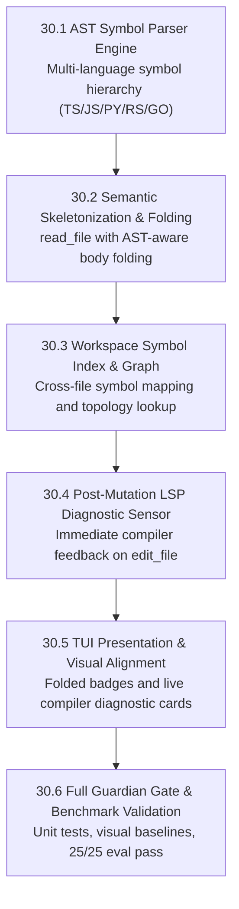

# Phase 30 — Deep Workspace AST & Semantic Code Graph

> **Version:** v1.3.0 → v1.4.0  
> **Date:** 2026-09-28  
> **Author:** Chief Engineer  
> **Core Mandate:** *"We are not making some cheap copy here; we are building frontier coding tools."*  
> **Scope:** Architecture and implementation of Anvil's deep workspace code intelligence: multi-language AST symbol extraction, semantic context folding for zero-token large file exploration, repository-wide symbol topology indexing, and instantaneous post-mutation LSP diagnostic feedback.

---

## 🏛️ 1. Frontier Vision: The Philosophy Behind Phase 30

Commodity coding assistants treat codebases as flat text streams. When investigating a bug or planning a refactor in a 50,000-line repository, standard agents:
1. Blindly run `read_file` on 2,000-line files, exhausting token budgets and triggering severe attention degradation (the "needle-in-a-haystack" loss).
2. Execute repetitive `grep` queries to locate type definitions, missing relationships between interfaces, implementations, and call sites.
3. Make speculative file mutations that introduce syntax errors or broken imports, only discovering them many turns later when an entire test suite fails.

**Frontier coding tools understand repository topology natively:**
- **Zero-Waste Exploration:** Files can be read as **Semantic AST Skeletons**. Signatures, types, interfaces, and docstrings remain intact, while implementation bodies are folded, reducing token consumption by **75–85%**.
- **Instant Project Topology:** Symbol definitions, exports, and call graphs are indexed in-memory, enabling microsecond symbol lookups across the monorepo.
- **Continuous Post-Mutation Diagnostics:** When `edit_file` completes, the active language server immediately checks the modified file. If a type error or broken import is introduced, the error is returned directly in the tool's output, giving the agent immediate micro-turn self-repair capabilities.

---

## 🗺️ 2. Architectural Blueprint & Wave Sequence

| Task | Focus Area | Impact | Priority | Status |
| :--- | :--- | :--- | :---: | :---: |
| **30.1** | AST Symbol Parser Engine (`packages/core/src/ast/`) | Robust multi-language AST symbol extractor | **P0** | **COMPLETE** |
| **30.2** | Semantic Skeletonization & Context Folding | `read_file` with AST folding (75–85% token reduction) | **P0** | **COMPLETE** |
| **30.3** | Workspace Symbol Index & Topology Graph | Cross-file symbol resolution and lookup tool | **P1** | **COMPLETE** |
| **30.4** | Post-Mutation LSP Diagnostic Sensor | Instant compiler error feedback in `edit_file` | **P0** | **COMPLETE** |
| **30.5** | TUI Presentation & Diagnostic Cards | Visual cards for folded ranges and compiler diagnostics | **P1** | **COMPLETE** |
| **30.6** | Guardian Quality Gate & Benchmark Suite | 100% green gate across 6 steps and 25/25 evals | **P0** | **COMPLETE** |

---

## 3. Detailed Task Specifications

### 30.1 — AST Symbol Parser Engine (`packages/core/src/ast/`)

#### Goal
Build a deterministic, ultra-fast AST parser capable of extracting nested symbols (classes, interfaces, methods, functions, type aliases, enums, exported variables) with precise line ranges, parameter signatures, and docstrings across TypeScript, JavaScript, Python, Rust, and Go.

#### Files to Create / Modify
- `packages/core/src/ast/types.ts`: Symbol hierarchy data models (`AstNode`, `SymbolKind`, `FileAst`).
- `packages/core/src/ast/parser.ts`: Language-specific tokenizers and block analyzers.
- `packages/core/src/ast/index.ts`: Public API export.
- `packages/core/src/ast/__tests__/parser.test.ts`: Exhaustive test cases across all target languages.

#### Acceptance Criteria
- Parses 1,000-line files in <3ms.
- Correctly identifies nested methods inside classes, interface signatures, and exported functions.
- Zero external runtime native dependencies (pure TypeScript/Node standard library).

---

### 30.2 — Semantic Skeletonization & Context Folding

#### Goal
Upgrade `read_file` and `get_outline` to support AST skeletonization: return structural signatures while folding method/function implementation blocks exceeding a threshold into clean folded comments (e.g. `/* ... 42 lines folded ... */`).

#### Files to Modify
- `packages/core/src/tools/readFile.ts`:
  - Add optional `skeleton?: boolean` or `mode?: "full" | "skeleton"` parameter to `inputSchema`.
  - When skeleton mode is requested, transform file content using the AST folding engine.
- `packages/core/src/tools/outline.ts`:
  - Upgrade `get_outline` to leverage AST symbol extraction.
- `packages/core/src/tools/__tests__/readFile.test.ts`:
  - Test skeleton output, line numbering preservation, and boundary conditions.

#### Acceptance Criteria
- Reading a 1,000-line module in `skeleton` mode yields the complete interface, method signatures, and types in <150 lines.
- Preserves accurate line numbers matching original file coordinates for subsequent `edit_file` targeting.

---

### 30.3 — Workspace Symbol Index & Topology Graph

#### Goal
Construct an in-memory repository symbol index (`WorkspaceSymbolIndex`) that catalogs exported symbols across all files, mapping definitions to file locations.

#### Files to Create / Modify
- `packages/core/src/ast/symbolIndex.ts`: In-memory symbol map with incremental updates on file write/edit.
- `packages/core/src/tools/findSymbol.ts`: Dedicated `find_symbol` tool for rapid global symbol resolution.
- `packages/core/src/tools/index.ts`: Register `find_symbol` in `TOOL_DEFINITIONS`.

#### Acceptance Criteria
- Symbol lookups resolve in <1ms across repositories with hundreds of source files.
- Refreshes incrementally when files are modified by `edit_file` or `write_file`.

---

### 30.4 — Continuous Post-Mutation LSP Diagnostic Sensor

#### Goal
Provide immediate compiler diagnostic feedback when mutating code with `edit_file` or `write_file`.

#### Files to Modify
- `packages/core/src/tools/editFile.ts`:
  - After atomic file write, query active LSP client for diagnostics on the mutated file (`diagnosticsForPath`).
  - Attach any compiler errors/warnings to the tool execution output under `diagnostics: [...]`.
- `packages/core/src/tools/writeFile.ts`:
  - Attach post-mutation diagnostics.
- `packages/core/src/lsp/client.ts`:
  - Expose fast per-path diagnostic query method.

#### Acceptance Criteria
- If an edit introduces a syntax error, unknown identifier, or type mismatch, the tool response highlights the exact diagnostic line and message.
- Bounded to 500ms timeout so LSP delays never freeze agent execution.

---

### 30.5 — TUI Presentation & Visual Alignment

#### Goal
Render folded code boundaries and compiler diagnostics with clean, professional visual hierarchy in `@anvil/tui`.

#### Files to Modify
- `packages/tui/src/components/MessageView.tsx`:
  - Style folded blocks with subtle muted syntax styling.
  - Render compiler diagnostic badges (`⚠ 1 error, 1 warning`) below mutation cards.
- `packages/tui/src/__visual__/visual.test.tsx`:
  - Capture and verify visual frames.

---

### 30.6 — Full Guardian Gate & Benchmark Validation

#### Goal
Achieve 100% compliance across the entire quality gate.

#### Acceptance Criteria
- `npm run gate` steps 0 through 5 pass 100% green.
- All unit, integration, and visual tests pass.
- 25/25 eval benchmark tasks pass.
