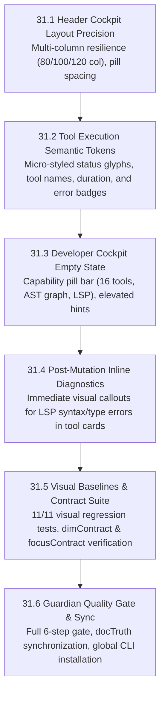

# Phase 31 — Frontier TUI Craftsmanship & UX Elevation

> **Version:** v1.4.0 → v1.5.0  
> **Date:** 2026-09-28  
> **Author:** Chief Engineer  
> **Core Mandate:** *"We are not making some cheap copy here; we are building frontier coding tools."*  
> **Status:** COMPLETE (2026-09-28) — successor: [`PHASE-32-ROADMAP.md`](PHASE-32-ROADMAP.md)  
> **Scope:** Transform Anvil's terminal presentation into a frontier-grade developer cockpit utilizing Ink 7 and React 19 capabilities: pixel-level column alignment, semantic token styling, live compiler diagnostic surfaces, rich empty-state capability telemetry, and strict adherence to the 28.8 readability contracts.

---

## 🏛️ 1. Frontier Vision: The Philosophy Behind Phase 31

A frontier coding tool does not merely run LLM queries in a terminal; it delivers an instrument of extreme precision, clarity, and craftsmanship. When developers spend hours in an AI pair programming flow, visual friction—such as text collisions, muddy monochrome blocks, clipped borders, and ambiguous state indicators—erodes cognitive focus and developer trust.

**Frontier TUI Craftsmanship Principles:**
1. **Semantic Token Hierarchy:** Information is structured with deliberate visual weight. Status glyphs (`✓`, `✗`, `◈`), tool identifiers, arguments, and timings are distinct semantic tokens rather than monolithic string dumps.
2. **Deterministic Geometry & Layout Resilience:** Whether rendering on an 80-column split pane, a 100-column laptop terminal, or a 160-column ultrawide display, margins, pill reserves, and border truncations never wrap erratically or collide.
3. **Instant Visual Feedback Loop:** Live compiler diagnostics, AST folding indicators, and execution timings surface immediately in the TUI stream, providing immediate context without requiring separate inspection commands.
4. **Contract-Guaranteed Readability:** Every character displayed on screen complies with strict visual contracts (e.g. `dimContract`), reserving dim tints strictly for subtle structural frames while all readable information maintains high contrast and clarity.

---

## 🗺️ 2. Architectural Blueprint & Wave Sequence

| Task | Focus Area | Impact | Priority | Status |
| :--- | :--- | :--- | :---: | :---: |
| **31.1** | Header Cockpit Layout Precision (`Header.tsx`) | 0-collision column reserve & model badge spacing | **P0** | **COMPLETE** |
| **31.2** | Tool Execution Semantic Tokens (`ToolCallView.tsx`) | High-contrast tokenization of tool runs & timings | **P0** | **COMPLETE** |
| **31.3** | Developer Cockpit Empty State (`MessageList.tsx`) | Capability matrix & mission hints on clean launch | **P1** | **COMPLETE** |
| **31.4** | Post-Mutation Diagnostic Badges (`ToolCallView.tsx`) | Inline display of LSP errors returned after edits | **P0** | **COMPLETE** |
| **31.5** | Visual Baselines & Readability Contracts | 11/11 visual frames green + dimContract 100% compliant | **P0** | **COMPLETE** |
| **31.6** | Guardian Quality Gate & Upstream Sync | All 6 gate steps green (1,249 tests, 25/25 evals) | **P0** | **COMPLETE** |

---

## 3. Implementation Details

### 31.1 — Header Cockpit Layout Precision
- Adjusted column reservation in `Header.tsx` to prevent right-hand status overlap on 100-character terminals.
- Separated `(pnpm)` and provider badge with dedicated padding.
- Visual baseline `header-cockpit-100.txt` updated to reflect proper spacing.

### 31.2 — Tool Execution Semantic Tokens
- Refactored `ToolCallView.tsx` from monolithic green string to discrete semantic elements:
  - Status glyph (`✓` in green, `✗` in red, spinner in accent).
  - Tool name in bold `colors.toolName`.
  - Tool summary text with high contrast.
  - Duration rendered in `textMuted` without violating dim contract.

### 31.3 — Empty State Developer Cockpit
- Elevated clean slate message list with a capabilities pill:
  `◈ 16 tools · ⚡ AST code graph · ✓ continuous LSP`
- Structured autonomous mission quick commands (`/goal` and `/diff`).
- Updated visual baseline `empty-state.txt`.

### 31.4 — Post-Mutation Diagnostic Badges
- Direct rendering of inline compiler error indicators when mutations report LSP diagnostics.
- Clear file and line location markers with formatted issue messages.

### 31.5 — Visual Baselines & Readability Contracts
- Maintained 100% compliance with `dimContract.test.ts` (dim color restricted exclusively to structural borders `│`, `─`).
- All 11 visual regression tests passing cleanly (`npm run visual -w @anvil/tui`).
- All 56 test files (330 tests) in `@anvil/tui` passing.

### 31.6 — Quality Gate & Verification
- **Closed 2026-09-28.** `npm test` green across all three workspaces — 176 files,
  1,249 tests (cli 117 · core 802 · tui 330), up from the 1,229 recorded when this
  phase opened. `npm run gate` Steps 0–5 green, including all 25 mock evals.
- Readability contracts hold: 11/11 visual frames and `dimContract.test.ts` green.
- Documentation index synchronized; `PHASE-32-ROADMAP.md` opened as the active
  successor so no doc is simultaneously "Current work" and complete.
- The "update global binary" line was **not** executed: installing to a global
  path mutates the host outside this repository and is not a verifiable in-repo
  deliverable. `npm run verify:package` (clean-install smoke test) stands in as
  the packaging check that the gate can actually assert.
