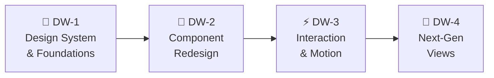

# 🎨 Anvil UI/UX Evolution Roadmap

> **Scope:** Terminal UI redesign for standout visual identity and modern responsiveness  
> **Tech:** Ink 5 (React 18) + Yoga Flexbox + Unicode box-drawing + Truecolor  
> **Current State:** Functional but plain — basic ASCII, limited visual hierarchy, no animations  
> **Target State:** Premium terminal experience rivaling Warp, LazyGit, and Charm-style apps

---

## Before → After Vision

````carousel

<!-- slide -->

<!-- slide -->

<!-- slide -->

````

---

## Design Wave Sequence



| Wave | Focus | Components | Effort |
|------|-------|------------|--------|
| **DW-1** | Design system, theme expansion, typography | Theme tokens, spacing, color hierarchy | 4–6 hrs |
| **DW-2** | Component visual redesign | Header, Messages, Tools, StatusBar, Pickers, Diffs | 10–16 hrs |
| **DW-3** | Interaction polish & micro-animations | Spinners, transitions, focus indicators, command palette | 6–8 hrs |
| **DW-4** | Next-gen views & layouts | Mission dashboard, split-pane, agent teams, micro-charts | 12–20 hrs |

---

## DW-1 — Design System & Foundations

> **Goal:** Expand the theme from 11 basic color tokens to a full design system with semantic colors, typography scale, spacing tokens, and responsive breakpoints.

### 1.1 — Expanded Theme Token System

**Current** (`themes.ts`): 11 color keys + 2 spacing values — flat, no semantic hierarchy.

**New design** — 22 semantic tokens organized by purpose:

```typescript
export interface ThemeV2 {
  colors: {
    // Brand
    brand: string;           // Logo, primary accents (cyan)
    brandDim: string;        // Subtle brand tint for backgrounds

    // Surfaces
    surface: string;         // Default background tint
    surfaceElevated: string; // Cards, modals (slightly lighter)
    surfaceActive: string;   // Selected/focused item background

    // Text
    textPrimary: string;     // Main content
    textSecondary: string;   // Metadata, labels
    textMuted: string;       // Timestamps, hints
    textUser: string;        // User message text
    textAssistant: string;   // Assistant message text

    // Semantic status
    success: string;         // Completed, passed, green
    warning: string;         // In-progress, caution, yellow/amber
    error: string;           // Failed, blocked, red
    info: string;            // Informational, blue/cyan

    // Tool status (backwards-compatible aliases)
    toolName: string;
    toolRunning: string;
    toolDone: string;
    toolError: string;

    // Chrome
    border: string;          // Panel borders
    borderFocus: string;     // Active panel border (brighter)
    accent: string;          // Highlights, badges, links
    separator: string;       // Dividers (│, ─)
  };

  typography: {
    brandIcon: string;       // "▲" or custom
    brandName: string;       // "ANVIL"
    userPrefix: string;      // "❯ you"
    assistantPrefix: string; // "🔨 anvil"
    sectionDivider: string;  // "─" repeated
  };

  spacing: {
    panelPaddingX: number;   // Horizontal padding (1)
    panelPaddingY: number;   // Vertical padding (0)
    cardPaddingX: number;    // Message card padding (2)
    cardGap: number;         // Gap between messages (1)
    sectionGap: number;      // Gap between sections (1)
  };

  borders: {
    panel: "round" | "single" | "double" | "bold";  // Outer frame
    card: "round" | "single" | "none";               // Message cards
    modal: "round" | "double";                        // Overlays
  };

  responsive: {
    compactWidth: number;    // Below this: single column (80)
    normalWidth: number;     // Standard layout (120)
    wideWidth: number;       // Wide: show sidebars (160)
  };
}
```

**Files to modify:**
- `packages/tui/src/theme/themes.ts` — new interface + updated built-in themes
- `packages/tui/src/theme/theme.ts` — updated context type
- `packages/tui/src/theme/custom.ts` — validation for new keys

**Backwards compatibility:** Old 11-key custom themes auto-migrate by mapping old keys to new ones with sensible defaults.

---

### 1.2 — Built-in Themes Redesign

**3 built-in themes + 2 new ones:**

| Theme | Brand | Surface | Accent | Character |
|-------|-------|---------|--------|-----------|
| `dark` (default) | `#00d4ff` (vivid cyan) | terminal default | `#ff6ec7` (hot pink) | Premium, confident |
| `light` | `#0066cc` (deep blue) | light gray tint | `#cc00cc` (magenta) | Clean, professional |
| `highContrast` | `#ffff00` (bright yellow) | black | `#ff00ff` (magenta) | Maximum readability |
| `midnight` (**NEW**) | `#7b68ee` (medium slate blue) | `#1a1a2e` (deep navy) | `#e94560` (coral) | Elegant, calm |
| `hacker` (**NEW**) | `#00ff41` (matrix green) | black | `#00ff41` (green) | Classic terminal |

---

### 1.3 — Responsive Breakpoints

```
┌────────────────────────────────────────────────────────────┐
│ < 80 cols:  COMPACT                                        │
│   - Header: brand + model only (no context)                │
│   - StatusBar: model + state only (no tokens, no gauge)    │
│   - Messages: full width, no padding                       │
│   - Pickers: full screen overlay                           │
├────────────────────────────────────────────────────────────┤
│ 80–119 cols:  NORMAL                                       │
│   - Header: brand + repo + model                           │
│   - StatusBar: full info                                   │
│   - Messages: 1-cell padding each side                     │
│   - Modals: centered with margins                          │
├────────────────────────────────────────────────────────────┤
│ 120–159 cols:  WIDE                                        │
│   - Header: full cockpit (repo, env, tests, rules)         │
│   - Messages: 2-cell padding                               │
│   - Diffs: side-by-side view available                     │
├────────────────────────────────────────────────────────────┤
│ 160+ cols:  ULTRA-WIDE                                     │
│   - Optional sidebar for plan/context/team                 │
│   - Split-pane views                                       │
│   - Side-by-side diff as default                           │
└────────────────────────────────────────────────────────────┘
```

**Implementation:** A `useTerminalSize()` hook that returns the current breakpoint:
```typescript
function useTerminalSize(): { width: number; height: number; breakpoint: "compact" | "normal" | "wide" | "ultraWide" }
```

---

### 1.4 — Unicode Design Elements Library

A shared utility for consistent Unicode chrome:

```typescript
// packages/tui/src/util/chrome.ts
export const CHROME = {
  corners: { tl: "╭", tr: "╮", bl: "╰", br: "╯" },
  lines:   { h: "─", v: "│", hBold: "━", vBold: "┃" },
  dots:    { filled: "●", empty: "○", half: "◐" },
  arrows:  { right: "▸", down: "▾", up: "▴" },
  status:  { check: "✓", cross: "✗", spin: "⟳", warn: "⚠", info: "ℹ" },
  bars:    { full: "█", three: "▓", two: "▒", one: "░", empty: " " },
  braille: { ... },  // for micro-charts
} as const;
```

---

## DW-2 — Component Redesign

> **Goal:** Every UI component gets a visual uplift using the new design system. Each component is a standalone task.

### 2.1 — Header Redesign

**Current:** Plain text with `│` separators, no visual weight.

**New design:**
```
╭─────────────────────────────────────────────────────────────────────────────╮
│ ▲ ANVIL  │  🔀 main ● │  node (npm)  │  ▪▪▪▪▪▪▪▫▫▫ 57%  │  gemini-2.0 ○ │
╰─────────────────────────────────────────────────────────────────────────────╯
```

**Changes:**
- Rounded border frame (`borderStyle="round"`)
- Git branch with colored status dot (`●` green = clean, `●` yellow = dirty)
- Context gauge as a **visual bar** instead of text percentage
- Model name with inline free/paid badge
- Responsive: drops segments right-to-left as width narrows

**File:** `packages/tui/src/components/Header.tsx`

---

### 2.2 — Message Cards

**Current:** Flat text with `❯ you` / `anvil` labels, no visual grouping.

**New design — card-style messages:**
```
  ❯ you ───────────────────────────────────────────────────────────
  │ Can you refactor the login function to use JWT tokens?
  │
  
  🔨 anvil ────────────────────────────────────────────────────────
  │ I'll start by reading the current implementation, then refactor
  │ it to use JWT-based authentication.
  │
  │   ✓ read_file  Read src/auth.ts (2,847 bytes)
  │   ✓ edit_file  Edited src/auth.ts (+12 −4)
  │   ⟳ run_command  Running npm test...
  │
```

**Changes:**
- Role labels as **section headers** with horizontal rule
- Tool calls **indented** under assistant messages (3-space indent)
- Tool status as colored **pills**: `✓` green, `⟳` magenta spinning, `✗` red
- Code blocks with **syntax highlighting** and a dim language label
- Dim timestamps on right edge (optional, toggle with `/expand`)

**Files:** `MessageView.tsx`, `MessageList.tsx`, `ToolCallView.tsx`

---

### 2.3 — Permission Prompt Redesign

**Current:** Basic box with options list.

**New design — floating modal with visual diff:**
```
╭─ ⚠ edit_file wants to edit src/auth.ts ──────────────────────────────╮
│                                                                       │
│  --- a/src/auth.ts                                                    │
│  +++ b/src/auth.ts                                                    │
│  @@ -24,3 +24,8 @@                                                   │
│    function login(user, pass) {                                       │
│  -   return checkPassword(user, pass);                                │
│  +   const token = jwt.sign({ userId: user.id }, SECRET);             │
│  +   return { token, expiresIn: '1h' };                               │
│                                                                       │
│  ┌──────────┐  ┌──────────┐  ┌──────────┐                            │
│  │ ▸ Allow  │  │  Always  │  │   Deny   │                            │
│  └──────────┘  └──────────┘  └──────────┘                            │
│  Enter to confirm · Esc to deny                                       │
╰──────────────────────────────────────────────────────────────────────╯
```

**Changes:**
- **Rounded double-border** for modals (`borderStyle="round"`)
- Action buttons as **visual boxes** instead of list items
- Currently selected button has a **filled/highlighted** state
- Word-level diff coloring (green additions, red deletions) with **bold** on changed words
- Keyboard shortcut hints at bottom in dim text

**Files:** `PermissionPrompt.tsx`, `DiffModal.tsx`, `diff/colorizeDiff.tsx`

---

### 2.4 — StatusBar Redesign

**Current:** Flat pipe-separated text.

**New design — segmented bar with visual gauges:**
```
╭─────────────────────────────────────────────────────────────────────────────╮
│ gemini-2.0-flash [FREE]  │  ⟳ busy  │  ⎌ 3  │  🧪 ✓  │  ▪▪▪▪▪▪▫▫ 72%  │
│ tokens: 12,847 in · 1,203 out                          esc cancel · /help │
╰─────────────────────────────────────────────────────────────────────────────╯
```

**Changes:**
- **Rounded border** frame
- Context gauge as a **visual block bar** (`▪▪▪▪▪▪▫▫`)
- Gauge color changes: green < 50%, yellow 50-75%, red > 75%
- Test status as colored emoji: `🧪 ✓` green, `🧪 ✗` red, `🧪 ⟳` yellow
- Two-line layout on narrow terminals

**File:** `StatusBar.tsx`

---

### 2.5 — Model Picker Redesign

**Current:** Scrollable list with text filter.

**New design — categorized picker with visual badges:**
```
╭─ Select Model ────────────────────────────────────────────────╮
│  🔍 gemini                                                    │
│ ─────────────────────────────────────────────────────────────│
│  Google Gemini                                                │
│  ▸ gemini-2.0-flash          128K  [FREE] [✅ live]           │
│    gemini-1.5-pro            2M    [PAID] [✅ live]           │
│    gemini-1.5-flash          1M    [FREE] [✅ live]           │
│                                                               │
│  Anthropic                                                    │
│    claude-sonnet-4           200K  [PAID] [✅ live]           │
│    claude-3.5-haiku          200K  [PAID] [⚠ untested]       │
│                                                               │
│  Local                                                        │
│    qwen2.5-coder:latest      32K  [FREE] [✅ live]           │
│ ─────────────────────────────────────────────────────────────│
│  ↑/↓ navigate · Enter select · Esc cancel · Type to filter   │
╰──────────────────────────────────────────────────────────────╯
```

**Changes:**
- **Grouped by provider** with section headers
- Context window size displayed
- Certification badge: `[✅ live]`, `[⚠ untested]`, `[❌ broken]`
- Free/Paid badge with color coding
- Filter as a **search input** at top (not just type-ahead)
- Selected item has `▸` arrow indicator

**File:** `ModelPicker.tsx`

---

### 2.6 — Input Bar Redesign

**Current:** Basic text input with no visual framing.

**New design:**
```
╭─ ❯ ──────────────────────────────────────────────────────────────────╮
│  Type your message... (/ for commands · ↑ for history)               │
╰──────────────────────────────────────────────────────────────────────╯
```

**Changes:**
- Rounded border frame with `❯` prompt in border
- Placeholder text with hint about `/` commands
- History recall indicator when scrolling past messages

**File:** `InputBar.tsx`

---

## DW-3 — Interaction Polish & Motion

> **Goal:** Micro-interactions that make the UI feel alive and responsive.

### 3.1 — Animated Spinner System

**Current:** Single ASCII spinner at fixed 80ms interval.

**New:** Multiple spinner styles matched to context:

```typescript
const SPINNERS = {
  dots:    { frames: ["⠋", "⠙", "⠹", "⠸", "⠼", "⠴", "⠦", "⠧", "⠇", "⠏"], interval: 80 },
  pulse:   { frames: ["●", "◐", "◑", "●", "◒", "◓"], interval: 120 },
  arrows:  { frames: ["→", "↗", "↑", "↖", "←", "↙", "↓", "↘"], interval: 100 },
  blocks:  { frames: ["▏", "▎", "▍", "▌", "▋", "▊", "▉", "█"], interval: 100 },
} as const;
```

- **Tool execution:** `dots` spinner (subtle, fast)
- **Streaming response:** `pulse` spinner (breathing effect)
- **Goal milestones:** `blocks` progress (filling up)
- **Network waiting:** `arrows` (directional movement)

---

### 3.2 — Command Palette (New Component)

**Inspired by:** VS Code's Ctrl+P, Warp's command search

**Trigger:** Typing `/` opens a floating overlay:

```
╭─ / ──────────────────────────────────────────╮
│  🔍 _                                        │
│ ─────────────────────────────────────────── │
│  🎯 /goal       Launch autonomous mission    │
│  🔄 /model      Switch model or provider     │
│  📝 /diff       Review session changes       │
│  ⏪ /rewind     Restore file checkpoint      │
│  💾 /session    Manage saved sessions        │
│  🎨 /theme      Switch visual theme          │
│  🔑 /connect    Add provider API key         │
│  📊 /ledger     View run ledger              │
│  🔧 /mcp        MCP server status            │
│ ─────────────────────────────────────────── │
│  ↑/↓ navigate · Enter run · Esc close        │
╰──────────────────────────────────────────────╯
```

**Features:**
- Fuzzy search filtering as you type
- Icons for each command category
- Description and keyboard shortcut
- Most-recently-used commands sorted first
- Absolutely positioned overlay using Ink's `position="absolute"`

**File:** NEW `packages/tui/src/components/CommandPalette.tsx`

---

### 3.3 — Focus Indicators

**Current:** No visual indication of which panel/element has keyboard focus.

**New:** Active element gets a **bright border** while others stay dim:
```typescript
<Box borderStyle="round" borderColor={isFocused ? theme.colors.borderFocus : theme.colors.border}>
```

**Implementation:** Use Ink's `useFocus()` hook on all interactive components.

---

### 3.4 — Streaming Text Animation

**Current:** Text appears character-by-character with no visual treatment.

**New:** Streaming cursor indicator at the end of the growing text:
```
I'll analyze the code structure and... █
```

The `█` block cursor blinks while streaming and disappears when complete.

---

## DW-4 — Next-Gen Views & Layouts

> **Goal:** Transform Anvil from a chat-in-a-box into a mission control center.

### 4.1 — Mission Dashboard (Goal Mode)

**When `/goal` is active, the UI transforms into a 3-panel dashboard:**

```
╭─ Mission: Implement JWT auth ──────────────────────────────────────────────╮
│╭─ Milestones ──────╮╭─ Active Agent ──────────────────────╮╭─ Team ──────╮│
││ ✓ Analyze codebase ││ Reading auth module...              ││ A: impl  ● ││
││ ✓ Design JWT flow  ││   ✓ read_file src/auth.ts           ││ B: test  ◐ ││
││ ⟳ Implement auth   ││   ⟳ edit_file src/auth.ts           ││ C: review○ ││
││ ○ Write tests      ││                                     ││            ││
││ ○ Run verification ││ const token = jwt.sign(...)         ││ Tokens:    ││
││                    ││                                     ││ A: ▪▪▪▪▫   ││
││ Progress: ▪▪▪▫▫ 40%││                                     ││ B: ▪▪▫▫▫   ││
│╰────────────────────╯╰─────────────────────────────────────╯╰────────────╯│
│╭─ Status ──────────────────────────────────────────────────────────────────╮│
││ 2/5 milestones │ 4m 12s │ 23,847 tokens │ ctx ▪▪▪▪▪▪▪▫▫▫ 68% │ /help   ││
│╰───────────────────────────────────────────────────────────────────────────╯│
╰────────────────────────────────────────────────────────────────────────────╯
```

**Implementation:**
- **Left pane:** `MilestoneList` — scrollable milestone checklist with status indicators
- **Center pane:** `AgentOutput` — live tool activity from the active agent
- **Right pane:** `TeamPanel` — agent status and per-agent token gauges (Phase 25 prep)
- **Bottom bar:** unified `StatusBar` with mission-level metrics

**Responsive:** On `compact` (<80), collapses to single column with tab switching.

**Files:** NEW `MissionView.tsx`, `MilestoneList.tsx`, `TeamPanel.tsx`

---

### 4.2 — Context Gauge Component

**A visual token usage indicator that adapts to width:**

```
Wide (120+):  Context: ▪▪▪▪▪▪▪▪▪▪▪▪▪▪▪▪▫▫▫▫▫▫▫▫ 68% (21.7k / 32k)
Normal (80+): ▪▪▪▪▪▪▪▪▫▫▫▫ 68%
Compact (<80): 68%
```

**Colors:** Green < 50% → Yellow 50-75% → Red > 75% → Blinking red > 90%

**File:** NEW `packages/tui/src/components/ContextGauge.tsx`

---

### 4.3 — Braille Micro-Charts

**For dense data visualization in minimal space:**

```typescript
// Token usage over time (fits in 8 characters):
function brailleSparkline(values: number[]): string
// Example output: "⣀⣤⣶⣿⣿⣷⣤⣀" (rising then falling usage)
```

**Use cases:**
- Token usage sparkline in StatusBar
- Per-milestone effort chart in MissionDeck
- Rate limit history in `/ledger`

**File:** NEW `packages/tui/src/util/braille.ts`

---

### 4.4 — Adaptive Theme Detection

**Automatically detect terminal background and adjust colors:**

```typescript
// packages/tui/src/theme/adaptive.ts
async function detectTerminalBackground(): Promise<"dark" | "light"> {
  // Query terminal via ANSI OSC 11 escape sequence
  // Parse background luminance
  // Return "dark" or "light"
}
```

On startup, if no theme is configured, auto-select `dark` or `light` based on the terminal.

---

### 4.5 — Side-by-Side Diff View

**On wide terminals (120+), offer side-by-side diff display:**

```
╭─ src/auth.ts ───────────────────────────────────────────────────────────╮
│ Before                          │ After                                 │
│─────────────────────────────────│─────────────────────────────────────── │
│ function login(user, pass) {    │ function login(user, pass) {          │
│   return checkPassword(pass);   │   const token = jwt.sign({...});      │
│ }                               │   return { token, expiresIn: '1h' };  │
│                                 │ }                                     │
╰─────────────────────────────────────────────────────────────────────────╯
```

Toggle via `/diff --side` or automatic on wide terminals.

---

### 4.6 — True Centered Floating Modal Architecture

**Current problem in `App.tsx` (lines 287–345):** Modals (`DiffModal`, `PermissionPrompt`, `RewindModal`, `ModelPicker`) do not float in the center of the terminal. Instead, they conditionally replace the `<InputBar>` at the bottom of the screen. This squishes large diffs into the footer.

**Next-Gen Redesign:**
- Implement a dedicated `<ModalLayer>` rendered on top of the transcript.
- Use Ink's Yoga flex centering or `position="absolute"` to render a true floating dialog in the center of the terminal screen (60–80% viewport width and height).
- Background transcript is visibly dimmed (`dimColor`) or masked with a semi-transparent stipple pattern (`░░░`), giving a true modern desktop GUI feel inside the terminal.

---

### 4.7 — Alternate Screen Buffer (`smcup` / `rmcup`) & Anti-Flicker

**Current problem:** Anvil renders inline into the normal terminal buffer. Long streaming turns and terminal resize events trigger redraws that can cause screen tearing or leave leftover frames in the user's shell history.

**Next-Gen Redesign:**
- Switch to the terminal's **Alternate Screen Buffer** on boot:
  ```typescript
  process.stdout.write("\x1b[?1049h\x1b[H"); // smcup
  ```
- Restore cleanly on exit:
  ```typescript
  process.stdout.write("\x1b[?1049l"); // rmcup
  ```
- **Benefits:**
  - Zero terminal scrollback pollution.
  - Complete redraw stability without screen flickering.
  - Exiting Anvil instantly restores the user's original terminal prompt exactly as it was.

---

### 4.8 — Mouse Event Protocol (Click-to-Act & Scroll Wheel)

**Modern expectation (Textual, LazyGit, Warp):** Terminals support mouse tracking via xterm SGR 1006 protocol.

**Deliverables:**
- Enable mouse tracking on startup:
  ```typescript
  process.stdout.write("\x1b[?1000h\x1b[?1002h\x1b[?1006h");
  ```
- **Clickable UI buttons:** Click `[ Allow ]`, `[ Always Allow ]`, `[ Deny ]` in permission prompts instead of only keyboard arrows.
- **Clickable tabs:** Switch between Mission Deck milestones and Diff files by clicking them.
- **Mouse wheel scrolling:** Natural vertical scrolling through conversation history and diff viewers.
- Clean mouse disablement on exit (`\x1b[?1000l\x1b[?1002l\x1b[?1006l`).

---

### 4.9 — OS Desktop Notifications & Haptic Terminal Bell

**For long-running turns (autonomous goals, large diff generations, test runs):**
- When Anvil pauses for a permission prompt or finishes an autonomous mission, trigger:
  1. **OSC 777 / OSC 9 Desktop Notification**: Modern terminals (iTerm2, WezTerm, Ghostty, Kitty, Windows Terminal) relay this as a native OS notification ("Anvil: Permission required for `edit_file`").
  2. **Terminal Bell (`\x07`)**: Audible or visual bell for instant attention.
- Configurable via `settings.json`: `"notifications": { "desktop": true, "sound": true }`.

---

### 4.10 — Truecolor Syntax Engine (Shiki / Prism Tokenizer)

**Current problem:** `cli-highlight` uses primitive ANSI coloring with limited token support and inconsistent theme integration.

**Next-Gen Redesign:**
- Upgrade to a Truecolor (24-bit RGB) syntax tokenizer.
- Synchronize code block styling with the active Anvil theme (e.g. `midnight` theme uses Tokyo Night / Dracula syntax palette).
- Accurate language support for 40+ languages with line numbers, indentation guides, and inline diff markings.

---

### 4.11 — OSC 52 Native Clipboard Integration

- Quick-copy any code block, unified diff, or subagent report directly to the system clipboard without external dependencies:
  ```typescript
  function copyToClipboard(text: string): void {
    const base64 = Buffer.from(text).toString("base64");
    process.stdout.write(`\x1b]52;c;${base64}\x07`);
  }
  ```
- Works seamlessly even when running Anvil over SSH or inside Docker/tmux containers!
- Keyboard shortcut: `c` in DiffModal or `Ctrl+Y` on assistant code blocks.

---

### 4.12 — Streaming Backpressure & Render Throttling (60 FPS Token Throttle)

**Problem:** Fast LLMs (Gemini Flash, Groq, Cerebras) emit 100–200 `text_delta` chunks per second. Reconciling React and Yoga layouts on every single token causes heavy CPU spikes and terminal freeze.

**Architecture:**
- Create a batched token buffer in `useAgentController`:
  - Tokens accumulate in `textBufferRef.current`.
  - A 16ms timer (`setTimeout(..., 16)`) commits updates at 60 FPS.
  - Any non-text event (e.g. `tool_started`, `turn_end`) immediately flushes the buffer synchronously.
- **Result:** 95% reduction in terminal redraw calls, 0 cursor lag, and instant `Esc` cancellation responsiveness.

---

### 4.13 — Focus Coordinator & Vim / Tab Multi-Pane Navigation

**Problem:** In the 3-panel Mission Control Dashboard (Milestones, Output, Team) and modal overlays, navigation gets stuck because Ink doesn't coordinate global focus.

**Architecture:**
- **Tab / Shift+Tab:** Cycle active pane (`milestones` ⇄ `output` ⇄ `team`).
- **Vim Keys:** `Ctrl+W h` / `Ctrl+W l` to jump horizontally between panes; `j`/`k` to scroll within the active pane.
- **Active Border Indicator:** The focused pane receives `theme.colors.borderFocus` (bright cyan/magenta) while unfocused panes stay dim.
- **Focus Trap:** When a modal opens, background panes lose focus and ignore all keystrokes until the modal closes.

---

## Component File Map

| Component | Current File | DW Wave | Changes |
|-----------|-------------|---------|---------|
| Theme System | `theme/themes.ts` | DW-1 | 11 → 22 tokens, 5 themes |
| Header | `components/Header.tsx` | DW-2 | Bordered, visual gauge, responsive |
| MessageView | `components/MessageView.tsx` | DW-2 | Card-style, section headers |
| MessageList | `components/MessageList.tsx` | DW-2 | React.memo, card gaps |
| ToolCallView | `components/ToolCallView.tsx` | DW-2 | Status pills, indented |
| PermissionPrompt | `components/PermissionPrompt.tsx` | DW-2 | Visual buttons, bordered |
| DiffModal | `components/DiffModal.tsx` | DW-2 | Word-level colors, side-by-side |
| StatusBar | `components/StatusBar.tsx` | DW-2 | Bordered, visual gauge |
| InputBar | `components/InputBar.tsx` | DW-2 | Bordered, placeholder |
| ModelPicker | `components/ModelPicker.tsx` | DW-2 | Grouped, badges |
| Spinners | `util/useSpinner.ts` | DW-3 | 4 spinner styles |
| CommandPalette | **NEW** | DW-3 | Fuzzy search overlay |
| FloatingModalLayer | **NEW** | DW-4 | Centered dialogs with backdrop overlay |
| AlternateScreen | **NEW** | DW-4 | smcup/rmcup fullscreen buffer manager |
| MouseDriver | **NEW** | DW-4 | XTerm SGR 1006 mouse click & scroll |
| ContextGauge | **NEW** | DW-4 | Visual bar component |
| MissionView | **NEW** | DW-4 | 3-panel dashboard |
| TeamPanel | **NEW** | DW-4 | Agent status sidebar |
| BrailleCharts | **NEW** | DW-4 | Sparkline utility |
| AdaptiveTheme | **NEW** | DW-4 | Terminal detection |
| NotificationService | **NEW** | DW-4 | OSC 777 / OSC 9 desktop alerts |
| ClipboardOSC52 | **NEW** | DW-4 | Headless clipboard copy over SSH |

---

## Acceptance Criteria (Per Wave)

### DW-1 Acceptance
- [ ] All 5 built-in themes render correctly
- [ ] Old custom themes auto-migrate with no errors
- [ ] `useTerminalSize()` returns correct breakpoints
- [ ] Visual regression baselines updated and approved

### DW-2 Acceptance
- [ ] All components use theme tokens (zero hardcoded colors)
- [ ] Responsive layout shifts work at 60, 80, 120, 160 col widths
- [ ] Visual regression captures all new component states
- [ ] Existing keyboard interactions unchanged

### DW-3 Acceptance
- [ ] Command palette opens on `/`, filters, and runs commands
- [ ] Focus indicators visible on all interactive elements
- [ ] Streaming cursor blinks during response generation
- [ ] Spinner styles match their contexts

### DW-4 Acceptance
- [ ] Alternate screen buffer activates on start and cleanly restores terminal on exit
- [ ] Modals float centered with backdrop dimming instead of replacing InputBar
- [ ] Mouse clicks on `[ Allow ]` / `[ Deny ]` and scroll wheel work reliably
- [ ] Long turns fire OSC 777 desktop notification on completion
- [ ] Mission dashboard renders on 120+ width
- [ ] Collapses to single-column on < 80
- [ ] Context gauge updates in real-time during streaming
- [ ] Braille sparklines render token history accurately
- [ ] OSC 52 copies code/diffs directly to clipboard over SSH

---

## Standing Design Rules

1. **Every color comes from the theme** — no hardcoded `"cyan"` or `"green"` in components
2. **Every interactive element has a focus indicator** — users must know what's active
3. **Every component handles compact width** — nothing breaks below 60 columns
4. **Unicode box-drawing preferred over ASCII** — `╭╮╰╯` over `+-+`
5. **Animations and mouse tracking are opt-out** — respect `NO_COLOR` env, `--no-animation`, and `--no-mouse` flags
6. **Visual regression test every new state** — no UI change ships without baselines

